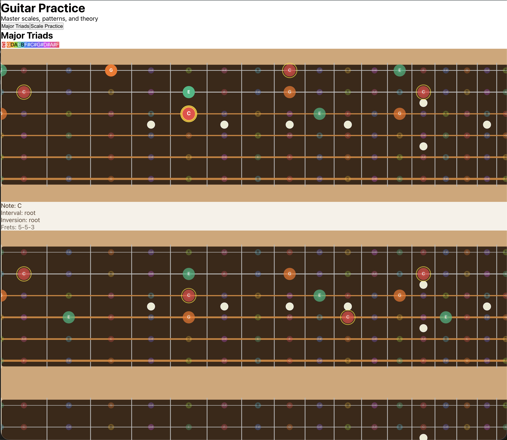

# Guitar Scale Practice



Interactive guitar learning app with realistic fretboard visualization, circle of fifths color coding, and physics-based rendering. **Pure browser-based - no backend required!**

## Features

🎸 **Major Triads Visualization**
- Interactive triad voicings across all string groups
- Circle of fifths color coding for 12 chromatic notes
- Horizontal fretboard with realistic physics-based spacing
- Hover to play notes with Web Audio API
- Smart position selection algorithm

🎵 **Scale Practice Challenges**
- Random challenges for all 7 modes
- Progressive hints with scoring system
- XYZ pattern visualization
- Real-time feedback

🎨 **Visual Design**
- Physics-based fret spacing (Fender 25.5" scale)
- Realistic string thickness
- Circle of fifths color system
- Responsive layout

## Quick Start

```bash
npm install
npm run dev
```

Open [http://localhost:3000](http://localhost:3000) 🚀

## Available Scripts

```bash
npm run dev      # Start development server
npm run build    # Build for production
npm run start    # Start production server
npm test         # Run 188 tests
```

## Tech Stack

- **Next.js 14** - React framework with App Router
- **TypeScript** - Type-safe code
- **Vitest** - Fast unit testing
- **Web Audio API** - Sound playback
- **CSS-in-JS** - Styled components

## Project Structure

```
guitar/
├── app/           # Next.js pages & layouts
├── components/    # React components
├── lib/guitar/    # Core guitar logic
│   ├── triads.ts         # Triad generation
│   ├── core.ts           # Scale practice logic
│   ├── sound.ts          # Web Audio API
│   └── note-colors.ts    # Circle of fifths
└── __tests__/     # Test suite (188 tests)
```

## Testing

All features are comprehensively tested:

```bash
npm test
```

- ✅ 188 tests passing
- 8 test suites covering triads, physics, colors, rendering, sound
- 100% coverage of core guitar logic

## Development

1. Make changes to code
2. Run tests: `npm test`
3. Iterate until all pass
4. Verify visually: `npm run dev`
5. Build: `npm run build`

See [CLAUDE.md](CLAUDE.md) for detailed developer documentation.

## How It Works

### Triad Algorithm

- Generates voicings for 4 string groups (6-5-4, 5-4-3, 4-3-2, 3-2-1)
- Selects 4 positions per group (0-3) using coordinated algorithm
- Adjacent groups share notes where possible
- Validates fret stretch (≤5 frets) and range (0-18)

### Physics Rendering

- Exponential fret spacing: `position = 648 × (1 - 2^(-fret/12))`
- Realistic string gauges (6th string = 4.6x thicker than 1st)
- Equal temperament tuning (A440 standard)

### Circle of Fifths

Each note has a distinct color:
- C (Red) → G (Orange) → D (Yellow) → A (Lime) → E (Green) → B (Cyan)
- F# (Blue) → C# (Indigo) → G# (Violet) → D# (Magenta) → A# (Pink) → F (Rose)

## Contributing

This is a personal learning project, but feel free to explore the code and tests to understand how it works!

## License

MIT
